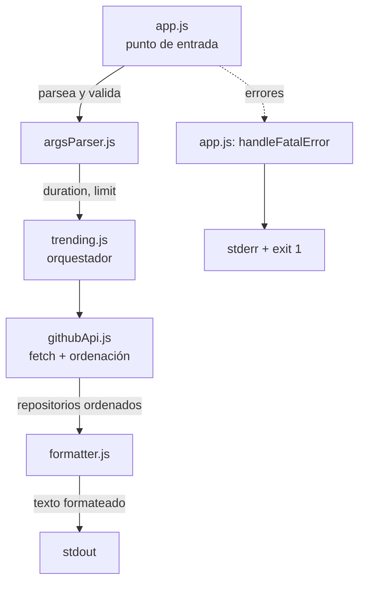
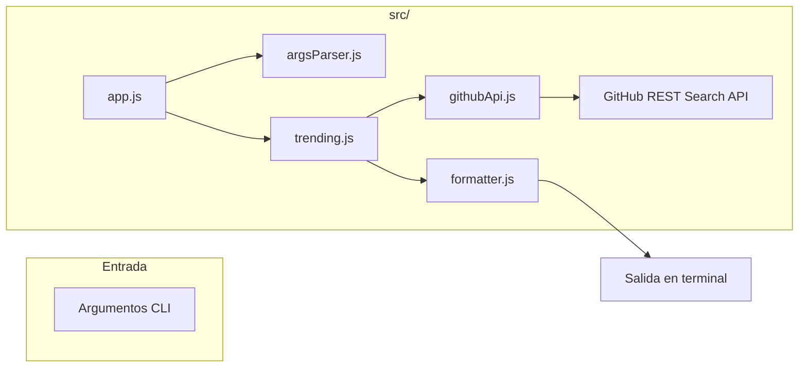

# GitHub Trending CLI

CLI ligero para consultar los **repositorios en tendencia de GitHub** directamente desde la terminal, sin abrir el navegador. Consulta la API REST de búsqueda de GitHub y muestra una lista numerada con las estrellas, el lenguaje y la descripción de cada repositorio.

> Todos los mensajes de la interfaz están en español.

## Estado

| Versión | Licencia | Runtime |
| --- | --- | --- |
| 1.0.0 | MIT | Node.js ≥ 18 |

## Índice

1. [Funcionamiento](#funcionamiento)
2. [Estructura del proyecto](#estructura-del-proyecto)
3. [Requisitos de instalación](#requisitos-de-instalacion)
4. [Instalación](#instalacion)
5. [Dominio de datos](#dominio-de-datos)
6. [Referencia de comandos](#referencia-de-comandos)
7. [Ejemplos de uso](#ejemplos-de-uso)
8. [Tests](#tests)
9. [Licencia y contribución](#licencia-y-contribucion)

## Funcionamiento

El programa se ejecuta como una CLI e implementa un flujo de **entrada → procesamiento → salida** en tres fases:

1. **Análisis de argumentos**: `app.js` recibe los argumentos de la línea de comandos y los valida (`parseArguments` + `validateOptions`).
2. **Consulta y ordenación**: `githubApi.js` calcula la fecha de inicio según la duración, construye la URL de la API de búsqueda de GitHub (`created:>YYYY-MM-DD&sort=stars&order=desc`) y la consulta con `fetch`. Los resultados se ordenan de forma descendente por número de estrellas sin mutar el array original.
3. **Formateo y salida**: `formatter.js` genera la lista numerada legible que se imprime en la terminal.

**Limitaciones**:
- La API pública sin autenticación de GitHub tiene un límite de **60 peticiones por hora** (respuesta HTTP 403 al superarlo).
- No se usa autenticación ni claves: solo el endpoint público de búsqueda.
- El resultado depende de los datos de la API en el momento de la consulta.

### Flujo interno



## Estructura del proyecto

```
Github-Trending-CLI/
├── app.js                     # Punto de entrada (shebang). Único gestor de errores
├── package.json               # Metadatos, scripts y binario `trending-repos`
├── .gitignore                 # Ignora node_modules/ y *.zip
├── src/
│   ├── consts/
│   │   └── options.js         # Constantes: duraciones, valores por defecto, URL de la API
│   └── lib/
│       ├── argsParser.js      # Parseo y validación de argumentos CLI
│       ├── githubApi.js       # Consulta a la API de GitHub y ordenación por estrellas
│       ├── formatter.js       # Formateo de la salida en terminal
│       └── trending.js        # Orquestador: fetch → ordenar → formatear
├── spec/
│   ├── constitution/          # Misión, stack técnico y roadmap del proyecto
│   └── features/              # Especificaciones, plan y tareas de cada feature
└── docs/
    ├── README.md              # Índice de documentación técnica
    └── 001-github-trending-cli.md  # Documentación técnica detallada
```

### Arquitectura por módulos



## Requisitos de instalación

- **Node.js ≥ 18** (se usa el `fetch` nativo de Node, disponible desde la versión 18).
- **Sin dependencias externas**: el proyecto no instala `node_modules`; usa únicamente módulos integrados de Node (`node:test`, `node:assert/strict`, `fetch`).
- **Conexión a internet** para consultar la API de GitHub.

## Instalación

No hay dependencias que instalar. Clona el repositorio y ejecuta:

```bash
git clone <url-del-repositorio>
cd Github-Trending-CLI
node app.js
```

Scripts disponibles en `package.json`:

| Script | Comando | Descripción |
| --- | --- | --- |
| `npm start` | `node app.js` | Ejecuta el programa con los valores por defecto |
| `npm run dev` | `node app.js` | Ejecuta el programa (equivalente a `start`) |
| `npm test` | `node --test "src/lib/*.test.js"` | Ejecuta la suite de tests |
| `npm run lint` | `node --check ...` | Verifica la sintaxis de todos los archivos fuente |

Instalación global opcional como comando del sistema:

```bash
npm link
trending-repos --duration day --limit 5
```

## Dominio de datos

### Entradas (argumentos CLI)

| Dato | Tipo | Valores válidos | Por defecto |
| --- | --- | --- | --- |
| `--duration` | string | `day`, `week`, `month`, `year` | `week` |
| `--limit` | entero | entero positivo > 0 | `10` |

### Salidas (stdout / stderr)

- **Éxito (stdout, exit 0)**: texto con la cabecera `Tendencias de GitHub (N repositorios):` y una entrada por repositorio con posición, nombre, estrellas, lenguaje y descripción.
- **Error (stderr, exit 1)**: mensaje prefijado con `Error:`.

### Formato de salida

```
#1 owner/repo
   Estrellas: 1234 | Lenguaje: Python
   Descripción del repositorio.
```

Los campos ausentes se protegen con valores de respaldo: `Desconocido` (nombre y lenguaje), `Sin descripción` (descripción) y `0` (estrellas).

## Referencia de comandos

```
trending-repos [--duration <day|week|month|year>] [--limit <entero-positivo>]
```

| Argumento | Tipo | Valores | Por defecto | Descripción |
| --- | --- | --- | --- | --- |
| `--duration` | string | `day`, `week`, `month`, `year` | `week` | Rango temporal de repositorios creados recientemente |
| `--limit` | entero | > 0 | `10` | Número máximo de repositorios a mostrar |

### Pruebas ejecutadas

Resultados reales verificados en esta sesión:

| Comando | Parámetros | Resultado esperado | Resultado real | Estado |
| --- | --- | --- | --- | --- |
| `node app.js` | sin parámetros | 10 repositorios de la última semana (exit 0) | Lista numerada de 10 repos (exit 0) | ✔ |
| `node app.js --duration day --limit 3` | duración `day`, límite `3` | 3 repositorios del último día | Lista de 3 repos (exit 0) | ✔ |
| `node app.js --duration month --limit 5` | duración `month`, límite `5` | 5 repositorios del último mes | Lista de 5 repos (exit 0) | ✔ |
| `node app.js --duration year --limit 2` | duración `year`, límite `2` | 2 repositorios del último año | Lista de 2 repos (exit 0) | ✔ |
| `node app.js --limit 7` | solo `--limit 7`, duration por defecto | 7 repos de la última semana | Lista de 7 repos (exit 0) | ✔ |
| `node app.js --duration week` | solo `--duration week`, limit por defecto | 10 repos de la última semana | Error 403 de rate limit por la API (aviso: prueba re-ejecutable superado el límite de 60 peticiones/hora) | ✘ |
| `node app.js --foo` | argumento desconocido | Error: argumento desconocido (exit 1) | `Error: Argumento desconocido: "--foo". Utiliza --duration y --limit.` (exit 1) | ✔ |
| `node app.js --duration hour` | duración no válida | Error: duración no válida (exit 1) | `Error: Duración no válida: "hour". Valores permitidos: day, week, month, year.` (exit 1) | ✔ |
| `node app.js --limit abc` | límite no numérico | Error: límite inválido (exit 1) | `Error: Límite no válido: "abc". Debe ser un número entero mayor que 0.` (exit 1) | ✔ |
| `node app.js --limit 0` | límite cero | Error: límite inválido (exit 1) | `Error: Límite no válido: "0". Debe ser un número entero mayor que 0.` (exit 1) | ✔ |
| `node app.js --limit -5` | límite negativo | Error: límite inválido (exit 1) | `Error: Límite no válido: "-5". Debe ser un número entero mayor que 0.` (exit 1) | ✔ |
| `node app.js --duration` | flag sin valor | Error de validación (exit 1) | `Error: Duración no válida: "undefined". Valores permitidos: day, week, month, year.` (exit 1) | ✔ |
| `node app.js --limit` | flag sin valor | Error de validación (exit 1) | `Error: Límite no válido: "undefined". Debe ser un número entero mayor que 0.` (exit 1) | ✔ |

**Notas**:
- La fila `✘` (`--duration week`) corresponde al rate limit real de GitHub (HTTP 403) alcanzado durante las pruebas tras 5 peticiones consecutivas: el programa respondió correctamente con el mensaje de error amigable y exit 1, tal como está diseñado. El comportamiento del flag en sí quedó validado por las filas `✔` anteriores.
- Los flags son independientes entre sí: no hay interdependencias ni combinaciones prohibidas.

## Ejemplos de uso

Con los valores por defecto (última semana, 10 repositorios):

```bash
node app.js
# Tendencias de GitHub (10 repositorios):
#
# #1 ai-sucks-butt/ai-sucks-butt
#    Estrellas: 2583 | Lenguaje: Python
#    If you think AI sucks, star the repo.
# ...
```

Repositorios creados en el último día, 3 resultados:

```bash
node app.js --duration day --limit 3
```

Repositorios del último mes, 20 resultados:

```bash
node app.js --duration month --limit 20
```

Solo límite personalizado (duración por defecto):

```bash
node app.js --limit 7
```

Ejemplo de error (argumento desconocido):

```bash
node app.js --foo

# Error:
# Argumento desconocido: "--foo". Utiliza --duration y --limit.
```

## Tests

El proyecto usa el **runner de tests integrado de Node.js** (`node:test`) con `node:assert/strict` y **cero dependencias externas**.

```bash
npm test
```

21 tests en 4 archivos y 7 suites, todos verificados en esta sesión (21/21 ✔):

| Archivo | Suites | Tests | Qué cubre |
| --- | --- | --- | --- |
| `src/lib/argsParser.test.js` | 2 | 9 | Valores por defecto, parseo de `--duration`/`--limit`, argumentos desconocidos, validación de duración y límite |
| `src/lib/githubApi.test.js` | 3 | 6 | Fecha de inicio, construcción de la URL, errores HTTP, ordenación por estrellas, inmutabilidad |
| `src/lib/formatter.test.js` | 1 | 4 | Mensaje de lista vacía, contenido, numeración y protección de campos ausentes |
| `src/lib/trending.test.js` | 1 | 2 | Orquestación completa (fetch mockeado) y delegación de errores |

**Verificación de sintaxis**:

```bash
npm run lint
```

## Licencia y contribución

Proyecto con licencia **MIT** (ver `package.json`). El desarrollo sigue una metodología **Spec-Driven** documentada en la carpeta `spec/`, con la misión, el stack técnico y el roadmap en `spec/constitution/`. El roadmap planifica futuras features:

- **002**: flag `--language` para filtrar por lenguaje de programación.
- **003**: exportación de la salida a un archivo `.json`.

Para contribuir, abre un issue o un pull request siguiendo las convenciones de `spec/constitution/tech-stack.md` (cero dependencias, ES Modules, sin `try/catch` en `src/lib`).